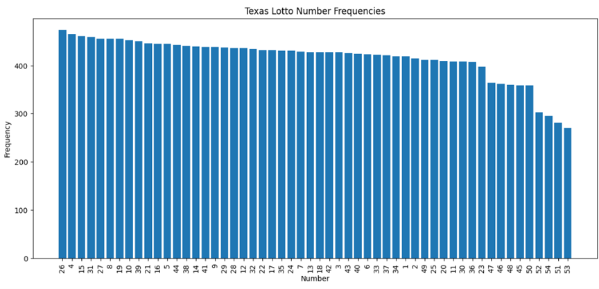
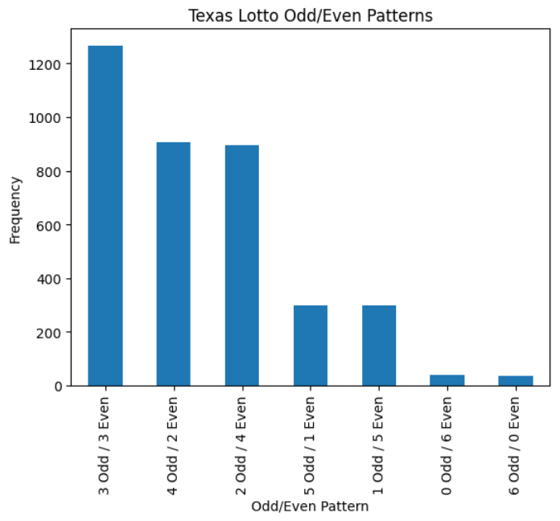
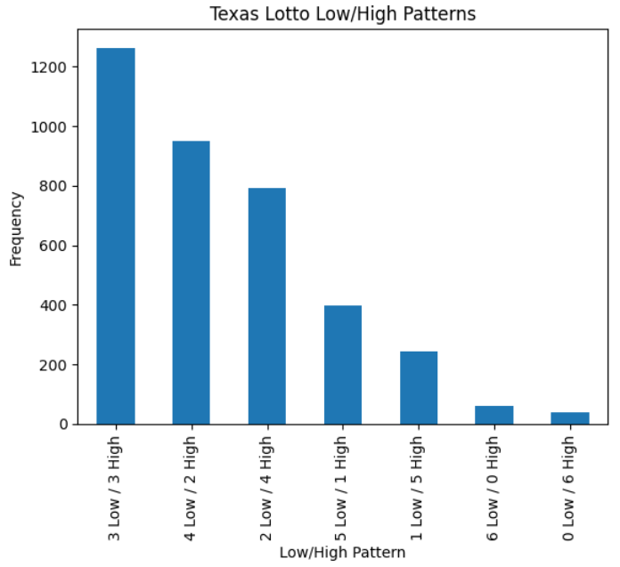
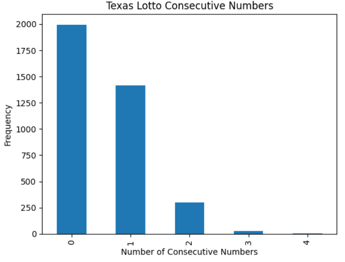
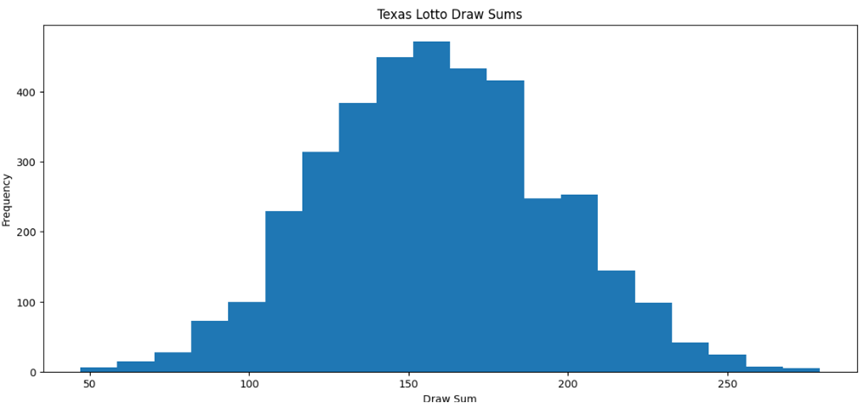
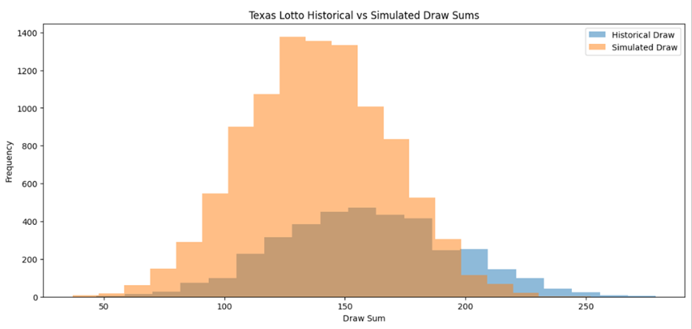
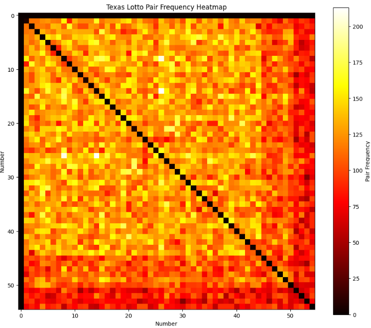
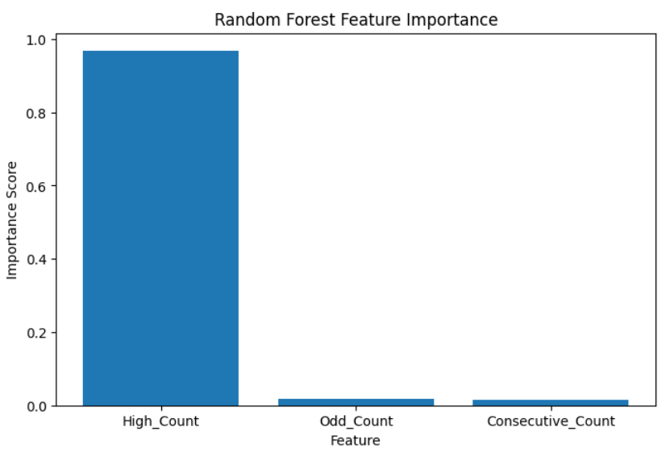
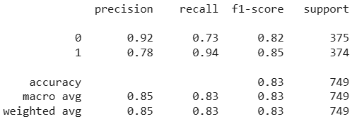

# Texas Lotto Statistical Analysis

## Project Overview

This project explores statistical behavior, probability distributions, simulation modeling, and predictive limitations within historical Texas Lotto draw data using Python-based analytics and machine learning techniques.

The analysis evaluates historical number frequencies, draw patterns, probability structures, inferential statistics, Monte Carlo simulation, and machine learning classification models.

---

## Technologies Used

- Python
- Pandas
- NumPy
- Matplotlib
- Scikit-learn
- SciPy
- itertools
- Google Colab

---

## Analytical Techniques

- Exploratory Data Analysis (EDA)
- Statistical Analysis
- Inferential Statistics
- Monte Carlo Simulation
- Probability Distribution Analysis
- Random Forest Classification
- Feature Engineering
- Heatmap Visualization

---

## Key Insights

- Historical lotto frequencies exhibited natural variation while remaining broadly consistent with random behavior.
- Odd/even and low/high number structures demonstrated recurring distribution patterns.
- Consecutive number combinations appeared less frequently than non-consecutive combinations.
- Monte Carlo simulation produced distributions similar to historical draw behavior.
- Machine learning classification models demonstrated measurable predictive capability for broader structural draw characteristics.

---

## Repository Structure

```text
notebooks/   -> Jupyter notebooks
reports/     -> Executive reports
images/      -> Project visualizations
data/        -> Datasets
```

---

## Sample Visualizations

### Lotto Number Frequencies



This visualization displays historical occurrence frequencies for each lotto number across the dataset.

---

### Odd/Even Number Patterns



This chart evaluates the distribution of odd and even number combinations within historical draws.

---

### Low/High Number Patterns



This analysis examines the balance between lower and higher number selections across historical lotto draws.

---

### Consecutive Number Analysis



This visualization measures the frequency of consecutive number occurrences within individual draws.

---

### Historical Draw Sum Distribution



This histogram illustrates the distribution of historical draw totals across the dataset.

---

### Historical vs Simulated Draw Distributions



Monte Carlo simulation results were compared against historical draw distributions to evaluate similarity in probabilistic behavior.

---

### Pair Frequency Heatmap



This heatmap visualizes co-occurrence frequencies between lotto number pairs across historical draws.

---

### Random Forest Feature Importance



Feature importance analysis identified the strongest structural variables influencing predictive model outcomes.

---

### Random Forest Classification Report



The Random Forest classification model demonstrated measurable predictive performance across broader draw structure categories.

---

## Author

Jose Reyes  
MS Business Analytics & Artificial Intelligence  
University of Texas Rio Grande Valley
